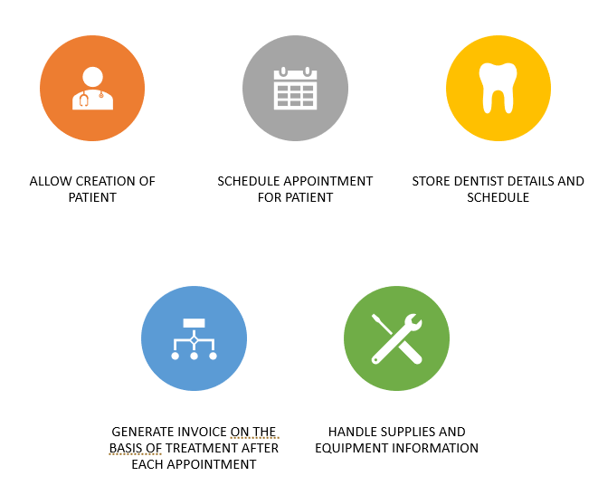
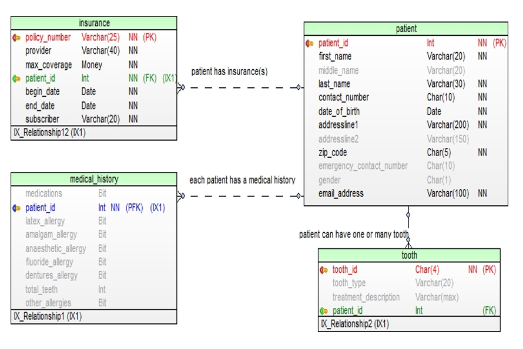
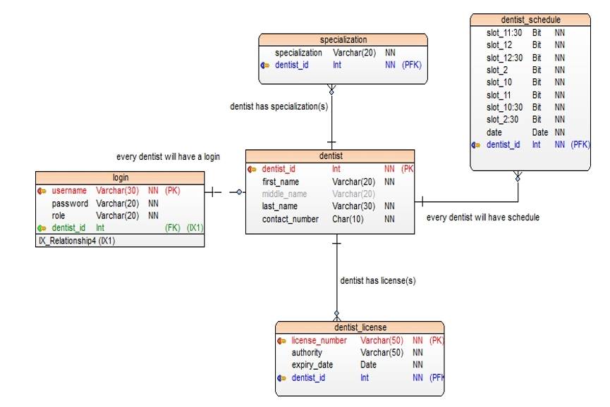
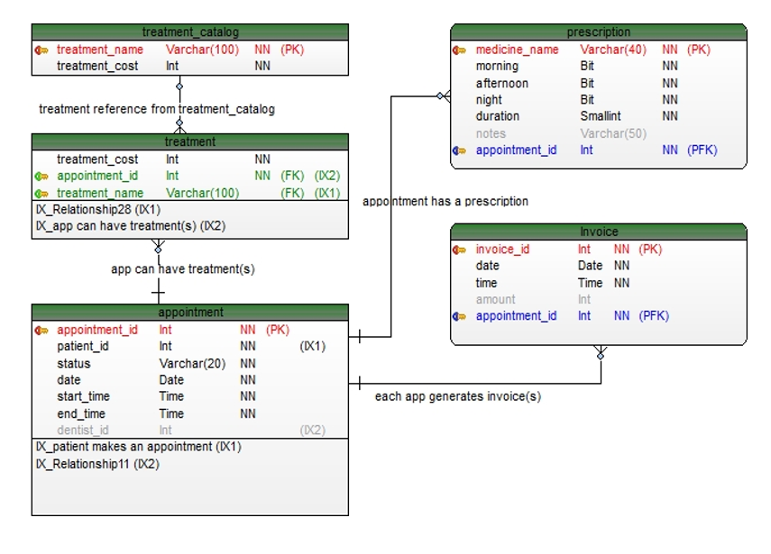
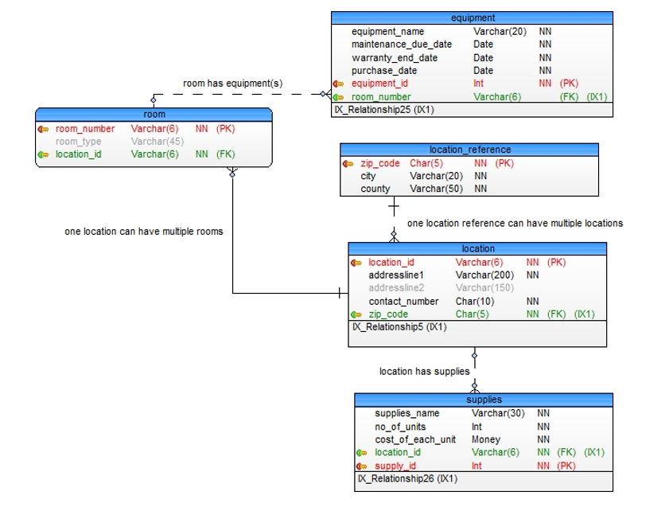

# Database Desing for Multi Location Dental Clinic

## OVERVIEW 
     	
The database is created to manage and address the appointments at a multi-location dental clinic. It will cater and support the following:  
1 - Scheduling appointments for patients  
2 - Storing information regarding their visit(s)  
3 - Managing diagnosis, treatment, and prescription related information  
4 - Managing invoice  
5 - Tracking information for the visits of the patients  
6 - Storing and managing medical details of the patient  
7 - Handling equipment and supplies information  

## MAIN FUNCTIONALITIES

  
 ## ENTITIES
 
 
  
  
  
  
  
  
  
  
  
  

## Installation

1 - Clone the Respoitory  
2 - Create database with name "Smile_Dental_Clinic" in Microsoft SQL Server  
3 - Run the DDL present in sql/mainddl.sql.SQL and sql/stored_ procs.sql  
4 - Open the Java Project in Java folder and run the code 
